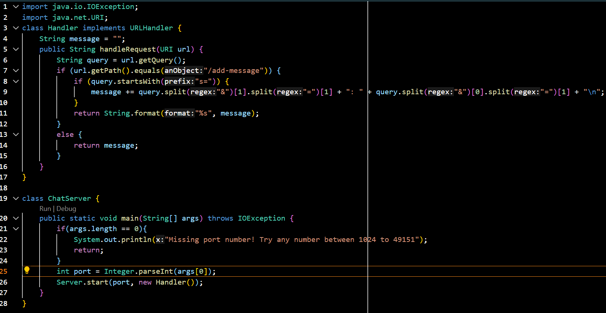
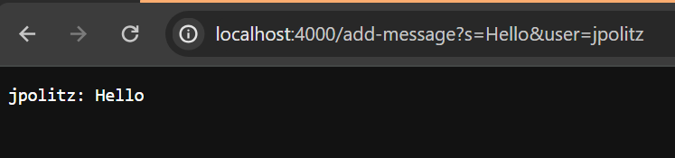
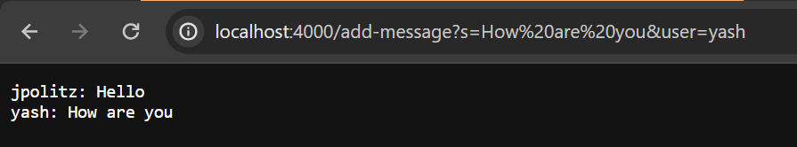

  
  
The handleRequest method is called which takes in a URI/L as an argument. This argument is taken and checks for /add-message path. Then it is split at both the & and = symbols to separate between the two parameters and to separate from the names of the parameters and the actual parameters. This is used to add a new message to the message value and then is returned.  

  
This does the same and calls the same handleRequest method again which takes in the URI/L argument. This method once again changes the message value but this time adds a new String to the existing String adding the newest message to the next line.  

