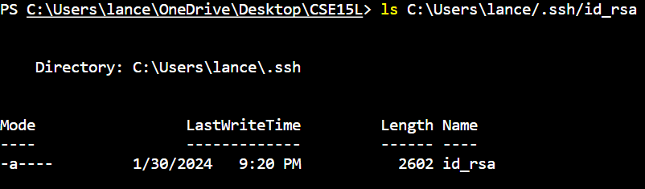
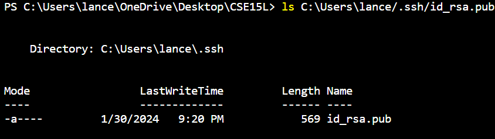
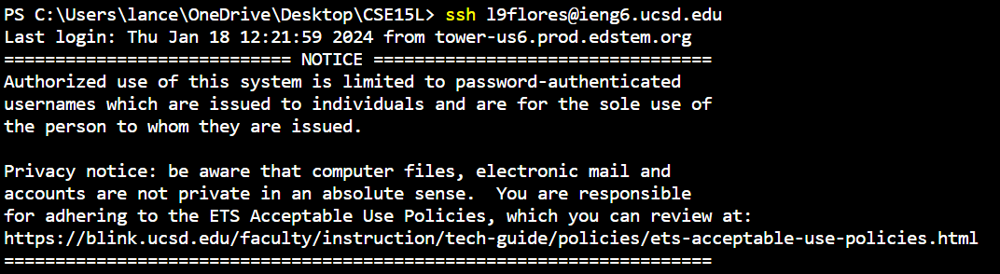

# Part 1
  
This is the code for `ChatServer.java`
  
The handleRequest method is called which takes in a URI/L as an argument named `url`. This argument is taken and checks for /add-message path. Then it is split at both the & and = symbols to separate between the two parameters and to separate from the names of the parameters and the actual parameters. This is used to add a new message to the `message` value and then is returned.  

  
This does the same and calls the same handleRequest method again which takes in the URI/L argument named `url`. This method once again changes the `message` value but this time adds a new String to the existing String which adds the newest message to the next line after the old messages.  

# Part 2
  
This is the private key which is shown to not have a .pub extension at the end indicating that it is not public and is showns to be within the `C:\Users\lance\.ssh` directory.

  
This is the public key which is similar to the private key but is shown to have a .pub extension indicating that this is the public key. This file is within the same `C:\Users\lance\.ssh` directory that the private key was in.

  
This is an image of the login to ieng6 not requiring a password to log in.

# Part 3
One thing that I learned from this past lab was the what the mkdir and scp commands are. I learned that mkdir stands for make directory and that scp is secure copy. The names are self-explanatory meaning that mkdir creates a new directory and scp copys a file from one place to another securely.
