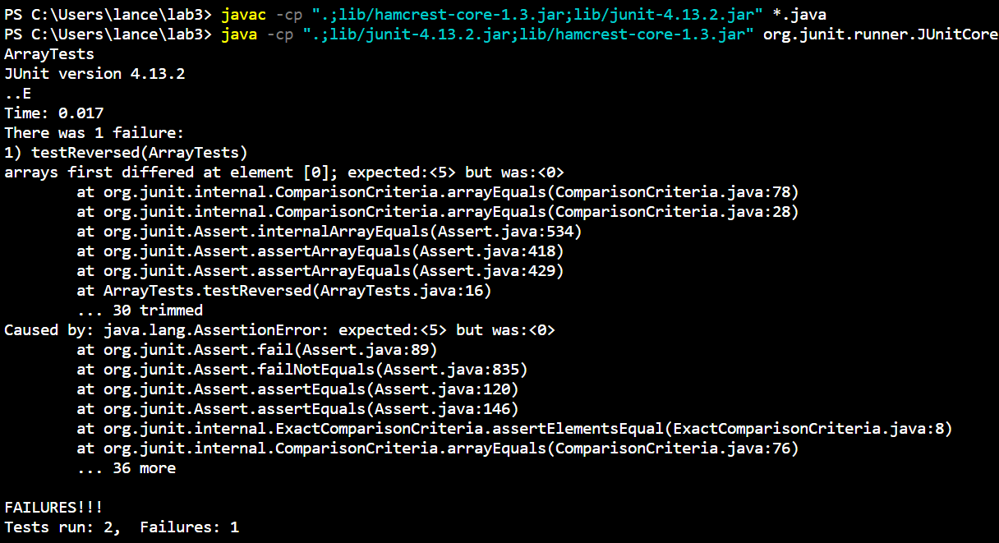
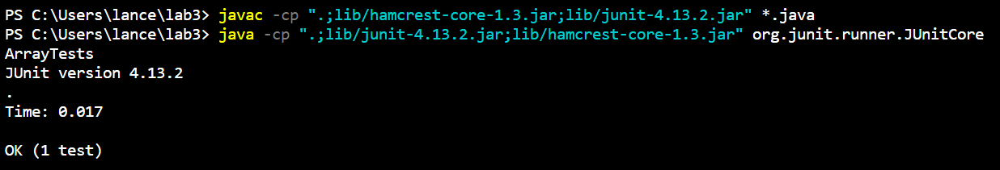

# Part 1
The bug I chose was the bug within the `ArrayExamples` file in the `reversed` method <br> <br>
Failure-inducing input
```
@Test
public void testReversed() {
    int[] arr = {1, 2, 3};
    assertArrayEquals(new int[]{3, 2, 1}, ArrayExamples.reversed(arr));
  }
```
This test fails since once you call `reversed` on `arr` instead of making a new reversed array, it empties out the array. <br> <br>

Non-failure-inducing input
``` 
@Test
public void testReversed() {
    int[] arr = {};
    assertArrayEquals(new int[]{}, ArrayExamples.reversed(arr));
  }
```
This test passes since the array starts out as empty, so when the `reversed` method is called nothing changes and it compares an empty array to another empty array. <br>

The symptoms <br>
Test Failure
 <br>
Test Success
 <br>

Before the bug is fixed
```
static int[] reversed(int[] arr) {
    int[] newArray = new int[arr.length];
    for(int i = 0; i < arr.length; i += 1) {
      arr[i] = newArray[arr.length - i - 1];
    }
    return arr;
  }
```

After the bug is fixed
```
static int[] reversed(int[] arr) {
    int[] newArray = new int[arr.length];
    for(int i = 0; i < arr.length; i += 1) {
      newArray[i] = arr[arr.length - i - 1];
    }
    return newArray;
  }
```
<br>
<br>

# Part 2
## grep -c
The `grep` command using the -c option will instead display the count of how many instances of the String it found.
```
grep -c "Study" 1468-6708-3-1.txt
4
```
In this example the `grep` command is used within the working directory `/technical/biomed` which outputs a value of 4. This is because within the `1468-6708-3-1.txt` file there exists 4 lines that include the String "Study" which it then outputs. This could be important as it has a similar use to the `wc` command and it shows the count of how many times it finds a specific String like "Study".
```
grep -c "coronary" 1468-6708-3-3.txt
40
```
In this example the `grep` command is again used within the working directory `/technical/biomed` searching in the file `1468-6708-3-1.txt` outputting a value of 40. This is because in file there are 40 lines that have the String "coronary" in it. This is important to find out the amount of instances of a String found within a file. <br><br>


## grep -i
The `grep` command can be used with -i which makes the String input not case sensitive, meaning it ignores whether or not a letter is captial.
```
grep -i "example" 1468-6708-3-4.txt
        Examples
          Example 1
          Example 2
          Example 3
          Example 4
          Example 5
        data from Example 4 above. In that study, 54 patients were
        example, we denote 24 (cr)for the former and 24 (d)for the
        other examples.
        assess the nature of the missing data. For example, if all
        such as in Example 3, all of the subsequent physiological
        exercise testing, as in Example 3, the exercise time should
        sample. Examples of MCAR include patients who have moved
          (until death) in such a design. A recent example is [ 8 ]
          type (a), as the Examples 1-5 (with the exception of
          Example 3) above have demonstrated. Unless the patient's
          Examples 3 and 5. Attempting to follow the principle of
        be found, for example, in [ 19 ] and [ 20 ] . No general
        test, and so on. Example 3 also used a ranking method after
        withdrawal [ 22 ] . For example, death would be given the
        not a nuisance effect. For example, the US Federal Drug
        done in Example 4 but not others. Recognizing that the
```
In this example `grep` is used to search the file `1468-6708-3-4.txt` for the word "example" but in the output it includes both "example" and "Example" showing that it ignores the case. This is important if someone wanted to find all instances of a word whether or not it is capitalized. In the example above, if -i was not used it wouldn't show every line with "Example" and only show lines with "example".

```
grep -i "use" 1468-6708-3-7.txt
        cause CHF. Because ALLHAT is an active-control trial, no
        Medline and the Cochrane databases were used to identify
          Use in Hypertension and Prostatism
          use of peripheral alpha-1 antagonists, the prevalence
          plasma norepinephrine levels are hypothesized to cause
          the treatment of hypertension with the use of peripheral
          focused on surrogate endpoints such as equivalence of
          Other studies focused on tolerability and pharmacology.
        Peripheral alpha-1 antagonists also cause neurohormonal
        hypertension are not known. These drugs appear to cause
        national recommendations to use low-dose diuretics or
```
This example shows every line including every instance of the String in the `1468-6708-3-7.txt` file. It includes both "Use" and "use" in its output since its ignoring the case. This has use in trying to find every instance of a String while trying to ignore the capital letters in it. <br><br>


## grep -n
`grep` can also use -n which has the same output but numbers each line it outputs according to where the line is found in the file. 
```
grep -n "heart" 1468-6708-3-10.txt
11:        compare the rate of fatal coronary heart disease (CHD) or
45:        outpatient], heart failure [HF/treated in the hospital or
163:          either of these alone, without other indications of heart
```
In this example `grep` is used on `1468-6708-3-10.txt` which outputs the lines it normally would, but includes the line number that each line was found in. When checking inside the file and going to the numbers on the left, you would find the corresponding line of text in that line. This can be used to more effectively wearch through a file and find the exact location for instances of a String within the file.

```
grep -n "Gad" 1471-213X-1-1.txt
11:        Gad1 and 
12:        Gad2 respectively [ 1, 2, 3]. GABA
27:        Gad2 knockout mouse [ 15, 16]. In
31:        Gad1 gene lead to defective
34:        Gad1 mutants suggests the involvement
48:        Gad1 transcript distribution in the
52:        Gad1 is indeed expressed in a number
55:        Gad1 transcripts accumulate in the
63:        Gad1 is expressed in several non-CNS
70:        Gad1 gene is widely expressed in the
74:        Gad1 transcripts in E8.5 to E14.5
78:        Gad1 transcripts were not detected in
80:        Gad1 was readily detected in the
87:        Gad1 expression throughout the
98:        Gad1 RNA was detected in and around
102:        Gad1 expression in the pouch endoderm
111:        Gad1 RNA was detected from E9.0 to
116:        Gad1 was expressed in a diffuse
123:        Gad1 in the forelimb reflects the
128:        Gad1 RNA was not detected in the
133:        Gad1 expression was detected in the
139:        Gad1 RNA was also detected in some of
145:        Gad1 expression was detected in the
151:        Gad1 expression was localized to the
156:        Gad1 probe were also performed.
165:        Gad1 was activated in several tissues
170:        Gad1 expression was largely outside
174:        Gad1 was detected in pharyngeal
177:        Gad1 is expressed in several sites
180:        Gad1-lacZ transgenes in the
187:        Gad1 can be regulated at the
189:        Gad1 mRNA translation or protein
196:        Gad1 mRNA and can produce the
200:        Gad1 mRNA that encodes GAD67 as well
203:        Gad1 regulation may control the
211:        Gad1 expression is first detectable
217:        Gad1 expression in the E9.0-E12.5
220:        Gad expression outside of the CNS. In
222:        Gad1 and
223:        Gad2 have been detected in a number
227:        Gad1 expression outside of the brain
231:        Gad1 is expressed in the olfactory
234:        Gad1 expression in these tissues
236:        Gad in the developing heart and blood
242:        Gad1 at additional non-CNS sites in
248:        Gad1 and the β3 GABA
256:        Gad1 is expressed in several
274:        Gad1 ) is expressed in the tail bud
279:        Gad1 expressing tissues (vibrissal
286:        Gad1 suggests a wider role for GAD
297:        Gad1 probe was derived from an EST
```
This example shows the `grep` command used on the file `1471-213X-1-1.txt` which outputs every line including "Gad" and the line number within the file. This is important since if we have a big list like this we know where the exact line number of where each line that includes a String is.<br><br>


## grep -w
`grep` also has the -w option which searches for the String as a single word within the file.
```
grep -w "believe" 1471-213X-1-2.txt
        We currently believe that migrating cells extend and
        the ALM migration defects. We believe, therefore, that the
```
In this example the output shows these 2 lines which both contain the word "believe". Since the instances of "believe" within the file are isolated, it gets output by the `grep -w` command. This is a good way to search through a file while looking for an isolated instance of a String rather than a String within another word. 

```
grep -w "lie" 1471-213X-1-2.txt

```
In this example the output is blank even though there are instances of "lie" within the file as shown by the previous example with beLIEve. The reason for these instances not showing is that "lie" is not isolated when inside the word "believe" which is caught by the -w option and is not shown because of it. This is an example of how this command could be useful since it doesn't have all instances of "lie" but only those that are a single isolated word.
