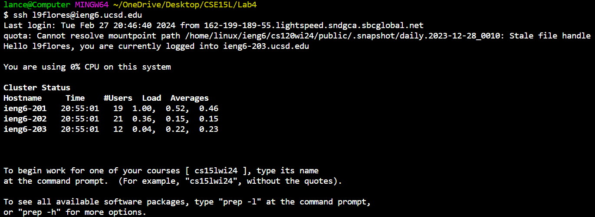
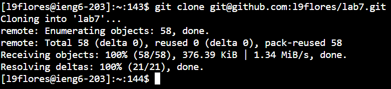
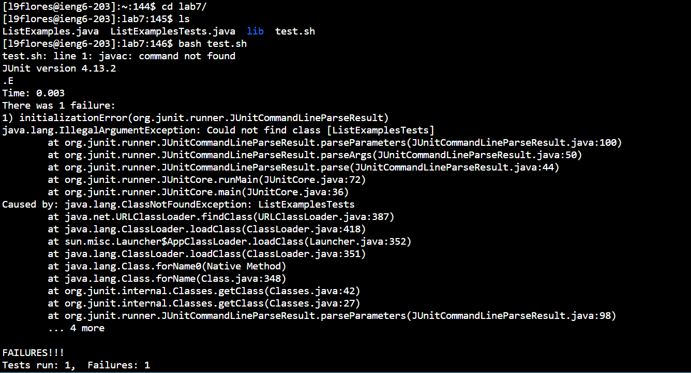
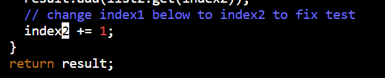
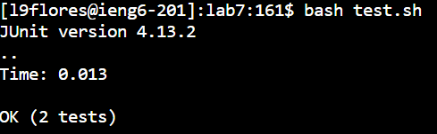
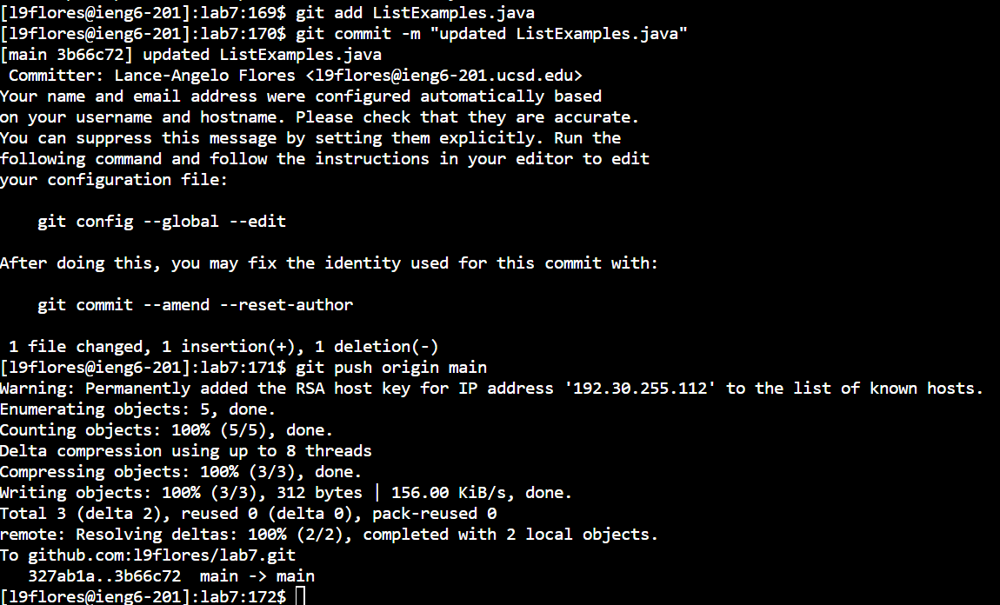

# Step 1 (login to ieng6): 
Keys pressed: `s s h <space> <ctrl> + v <backspace> <backspace> <backspace> <backspace> l 9 f l o r e s <enter>`   
Explanation: to login to ieng6, I typed "ssh" then pasted the place to login to from a previous week and edited the username to be my username.   
  

# step 2 (clone repository):
Keys pressed: `g i t <space> c l o n e <space> <ctrl> + v <enter>`   
Explanation: to clone the repository, I started by typing "git clone" and pasted the ssh link from my fork on github.    
  

# step 3 (run tests): 
Keys pressed: `c d <space> l <tab> <enter> l s <enter> b a s h <space> t <tab> <enter>`   
Explanation: to run the tests, I make sure I am in the correct directory by switching to the `lab7/` directory using the `cd` command and typing "l" and finishing the command using a tab input. Then I `ls` to make sure I correctly entered the directory and type `bash t` and finish the command with a tab.   
  

# step 4 (fix code): 
Keys pressed: `v i m <space> <shift> + l <tab> . <tab> <enter> / i n d e x 1 <enter> n n n n n n n n n <right> <right> <right> <right> <right> r 2 : w q <enter>`   
Explanation: To change code using vim, I first entered vim by using the `vim` command with the argument `ListExamples.java` which was typed using "L" then tab to complete `ListExamples` then "." to add the `.java` on the end. Next I use the search function to search for "index1" and use multiple "n" presses to move to the correct instance of "index1". I move to the right to replace only the number by using "r" and replacing it with a "2". I then save and exit using `:wq`.   
  

# step 5 (rerun tests): 
Keys pressed: ` b a s h <space> t <tab> <enter>`   
Explanation: I rerun the tests the same way I ran it earlier, using the command `bash` on `test.sh`.   
  

# step 6 (commit changes): 
Keys pressed: `g i t <space> a d d <space> <shift> + l <tab> . j <tab> <enter> ,,, g i t <space> c o m <tab> - m <space> " u p d a t e d <space> <shift> + l i s t <shift> + e x a m p l e s . j a v a " <enter> ,,, g i t <space> p u s h <space> o <tab> m <tab> <enter>`    
Explanation: To commit the changes I used `git add ListExamples.java` then `git commit -m "updated ListExamples.java` with the message "updated ListExamples.java" then `git push origin main` to push it to github.   
  
