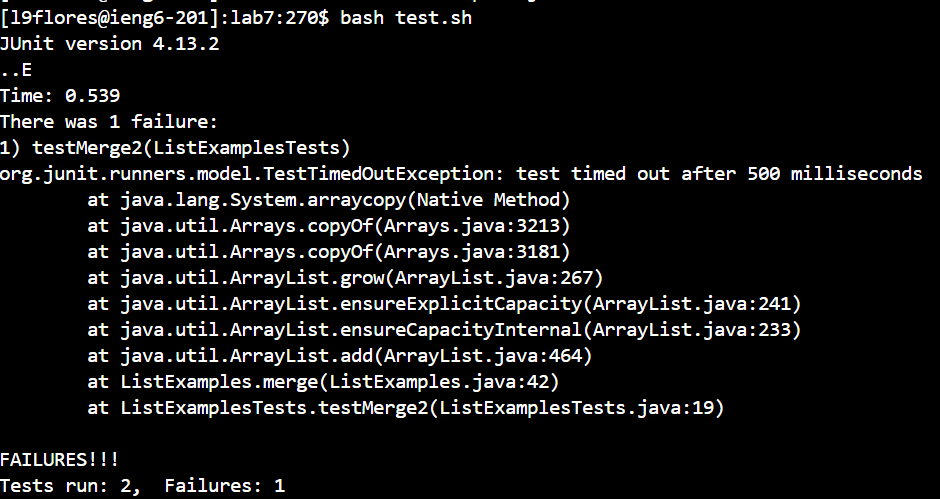
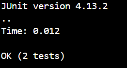

# Part 1
## 1. Post
I don't understand why this is giving me the error that one of the tests are failing. It tells me that after running the test cases, the test times out. Im guessing that its something wrong with a loop happening somewhere but I can't seem to find one. <br>
 <br>

## 2. Response
If you think that the error might be an infinite loop try checking each of your loops to make sure that you can actually exit those loops to ensure no infinite loops happen anywhere.

## 3. Trying the feedback
I checked both of the loops and it seems that my second loop actually increments the wrong variable which means that the vatriable within the while loop never changes causing that loop, thanks.<br>
 <br>

## 4. The bugs
The setup to this was that I had ListExamples.java and ListExamplesTests.java with test.sh as a bash script to run the tests file located in the same folder plus the junit files to make sure the tests work. This was the code within the ListExamplesTests.java file before I fixed it<br>
```
while(index2 < list2.size()) {
      result.add(list2.get(index2));
      index1 += 1;
    }
```
<br>
When I ran `bash test.sh` to run the tests, it came up with one failure in the tests. It told me in that fail case that the test had a `TestTimedOutException` and I thought something had looped too many times and after checking both my loops I realised that one loop never incremented and kept looping. To fix this I made sure it incremented the correct variable in order to be able to exit the loop. To do that I ran `vim ListExamples.java` and went to the incorrect line to change it using the key press `r 2` to change the `index1` variable into `index2`.


# Part 2
This second half of the semester, something I learned was about jdb. It seems like a good alternative from just writing print statements in order to check whether my code works. I feel like in some cases jdb would work better and more efficiently, especially for things like loops where it runs the same code multiple times since with breakpoints you can isolate each specific time the loop runs.
